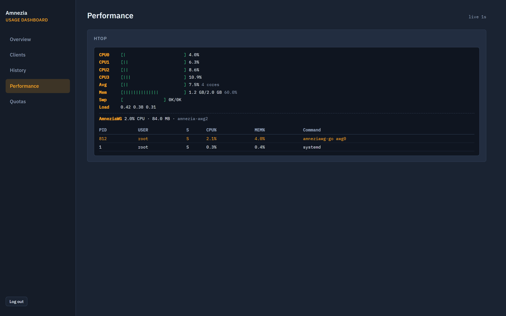

# Amnezia Usage Dashboard

Web panel for an existing **AmneziaWG** server: who is online, how much traffic each client used, history charts, optional quotas, and live VPS load.

Runs in Docker **next to** AmneziaVPN. It does **not** replace Amnezia and does **not** rename your VPN container.


## What you get

| Page | What it shows |
|---|---|
| **Overview** | Online clients, speeds, today / 7 days / month / lifetime traffic, VPS + AmneziaWG CPU/RAM |
| **Clients** | Handshake age, lifetime counters, enable / disable a peer |
| **History** | 7 / 30 / 90 day charts and each client’s share |
| **Quotas** | GB cap per day, rolling week, calendar month, or lifetime (auto-disable when exceeded) |
| **Performance** | Live htop-style per-core CPU, memory, AmneziaWG container, top processes |

Traffic numbers are from the **client’s** view (download / upload).

Status (hardcoded + config — not guessed):

- **online** — last handshake ≤ **3 minutes**
- **idle** — handshake older than 3 minutes, but ≤ `ONLINE_THRESHOLD_SEC` (default **15 minutes**)
- **offline** — older than that

WireGuard has no real “session” flag when PersistentKeepalive is off; that is why **idle** exists.

## Install (recommended)

On the **same Linux VPS** where AmneziaWG already runs:

```bash
git clone https://github.com/int-cloud-automation/amnezia-usage-dashboard.git
cd amnezia-usage-dashboard
chmod +x install.sh
./install.sh
```

`install.sh` will:

1. Find a running AmneziaWG container (`awg show all dump`) — **never renames it**
2. Create `.env` with a random admin password and `SECRET_KEY`
3. Set timezone from the host (`timedatectl`, else `UTC`)
4. Start Docker Compose in **LAN mode** (HTTP on port **8080**)
5. Print the login URL and password once

### LAN / VPN only (default)

```bash
./install.sh --lan
```

Then open:

| From | URL |
|---|---|
| Same machine | `http://127.0.0.1:8080` |
| Same LAN | `http://<server-lan-ip>:8080` |
| Connected to this AmneziaWG | `http://<vpn-server-ip>:8080` (often `10.8.1.1` — check your client config) |

Do **not** forward port 8080 from the public internet.

### Public HTTPS (domain + Caddy)

Only if you already have a DNS name pointing at this VPS:

```bash
./install.sh --public --hostname stats.example.com
```

Opens `https://stats.example.com`. Port 8080 stays internal; Caddy listens on 80/443.

### Install with an AI

Give the agent shell access on the Amnezia host and point it at [`AGENT_INSTALL.md`](AGENT_INSTALL.md) (it runs `install.sh`).

## Screenshots

Demo data (`phone`, `laptop`, `tablet`, `work`) — not a real VPN.

| Login | Overview |
|---|---|
|  |  |

| Clients | History |
|---|---|
|  |  |

| Quotas | Performance |
|---|---|
|  |  |

## Requirements

- Linux host with **AmneziaWG already running in Docker**
- **Docker Engine** + **Compose v2** (`docker compose version`)
- Outbound HTTPS to pull images
- For public mode only: a **DNS name** for this VPS

Check AmneziaWG is readable:

```bash
docker ps --format '{{.Names}}' | grep -iE 'awg|amnezia'
docker exec <container> awg show all dump
```

If `awg show all dump` fails, the dashboard cannot collect stats. **Do not rename** the Amnezia container — the Amnezia desktop app depends on the original name.

## Manual start (if you skip install.sh)

```bash
cp .env.example .env
# set ADMIN_PASSWORD, SECRET_KEY, AWG_CONTAINER, STATS_TIMEZONE
# LAN:
#   SESSION_HTTPS_ONLY=false
docker compose -f docker-compose.yml -f docker-compose.lan.yml up -d --build
```

Public (edit `Caddyfile` hostname first):

```bash
docker compose up -d --build
```

## Local demo (no VPN, for screenshots / UI)

Needs Python 3.12+:

```bash
python -m venv .venv
# Windows: .venv\Scripts\activate
# Unix:    source .venv/bin/activate
pip install -r requirements.txt
export AWG_MODE=demo ADMIN_PASSWORD=demo SECRET_KEY=dev DATABASE_PATH=./data/demo.db SESSION_HTTPS_ONLY=false
uvicorn app.main:app --reload --port 8080
```

Open http://127.0.0.1:8080 — user `admin`, password `demo`.

## Configuration

| Variable | Meaning |
|---|---|
| `ADMIN_USER` / `ADMIN_PASSWORD` | Panel login |
| `SECRET_KEY` | Session signing key |
| `AWG_MODE` | `docker_exec` (normal) / `local` / `demo` |
| `AWG_CONTAINER` | Existing AmneziaWG container name — **do not rename the container** |
| `AWG_CONF_PATH` / `AWG_CLIENTS_TABLE` | Paths *inside* that container |
| `STATS_TIMEZONE` | IANA zone for “today” and quota periods (`UTC`, `Europe/Moscow`, …) |
| `ONLINE_THRESHOLD_SEC` | Max handshake age for **idle** (default `900`). **Online** is always ≤ 180s in code |
| `SESSION_HTTPS_ONLY` | `true` behind HTTPS; **`false` for HTTP on LAN** |
| `HOST_PROC_PATH` | Host `/proc` mount inside the app container (default `/host/proc`) for Performance |

## Security notes

- Change password and `SECRET_KEY` before anyone can reach the panel (`install.sh` does this)
- Prefer an extra gate (Cloudflare Access, VPN-only, LAN firewall) in front of login
- Quotas remove the peer from the *live* interface; they do not edit `awg0.conf` on disk
- A peer you disable by hand stays disabled even if a quota would re-enable it
- The app talks to Docker through a socket proxy (`exec` / `inspect` only), not a raw `docker.sock` mount into the app container

## Stop

```bash
# LAN install
docker compose -f docker-compose.yml -f docker-compose.lan.yml down

# Public install
docker compose down
```

This does **not** stop AmneziaWG.

## License

MIT
