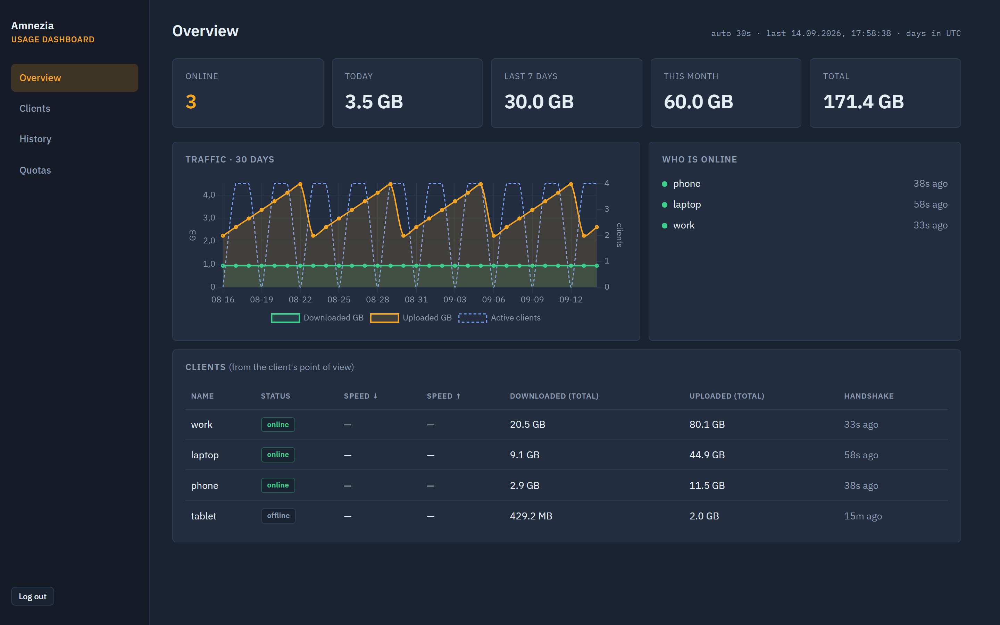
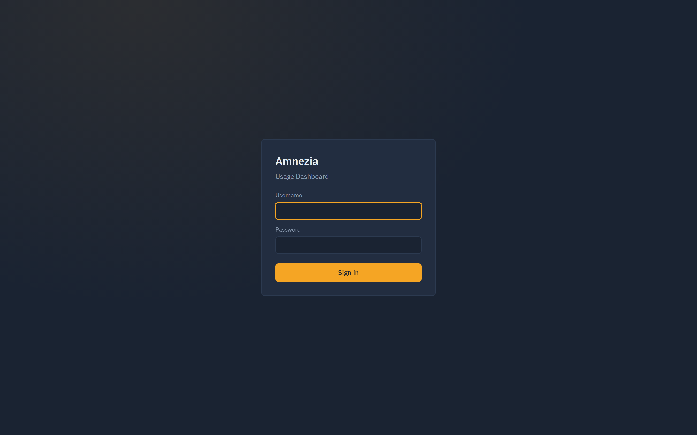
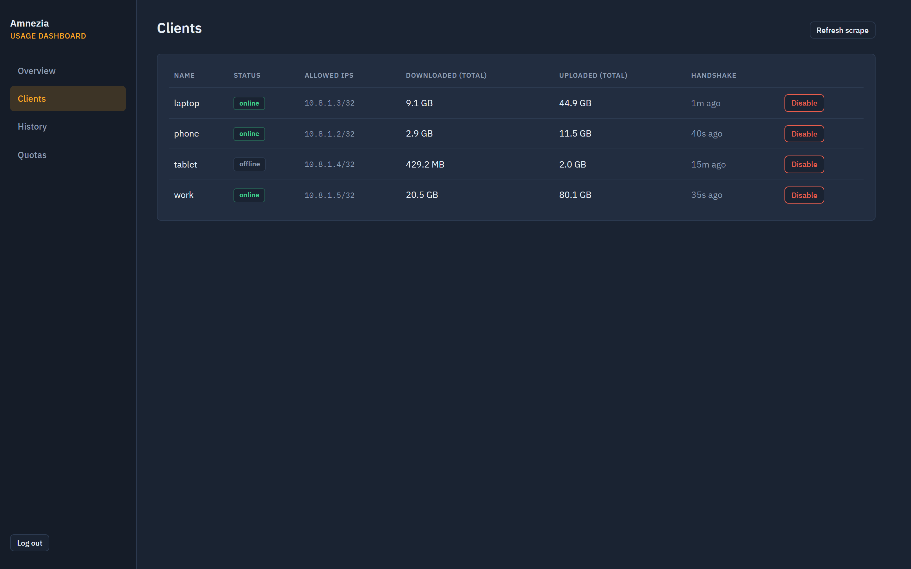
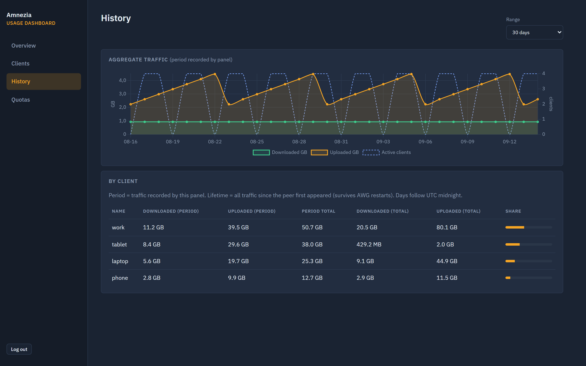
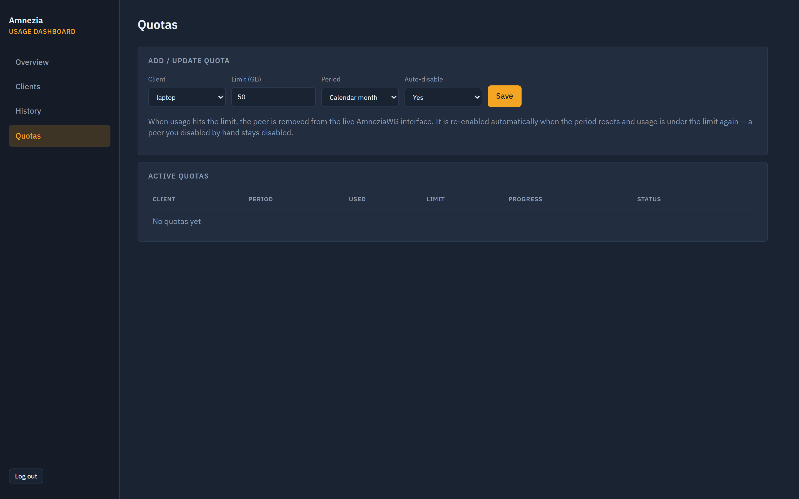

# Amnezia Usage Dashboard

A small dashboard for **AmneziaWG**: who is online, how much they transferred, history, and optional traffic quotas.

Built for a single VPS and a handful of peers. FastAPI + SQLite, one Docker Compose file, no extra monitoring stack.

[English](#amnezia-usage-dashboard) · [Русский](#русский)



## What it does

- **Overview** — live online status, download/upload speed, today / 7 days / month / lifetime totals
- **Clients** — handshake, lifetime traffic, enable / disable a peer
- **History** — 7 / 30 / 90 day charts and per-client share
- **Quotas** — GB cap per day, rolling week, calendar month, or lifetime; auto-disable when exceeded

Traffic is shown from the **client's** point of view (downloaded / uploaded). “Online” means a handshake within the last 3 minutes.

## Screenshots

Demo data (`phone`, `laptop`, `tablet`, `work`) — not a real VPN.

| Login | Overview |
|---|---|
|  |  |

| Clients | History |
|---|---|
|  |  |



## Quick start (VPS)

AmneziaWG should already be running in Docker. The dashboard talks to that container through a **socket proxy** (not a raw `docker.sock` mount).

```bash
git clone https://github.com/meledinalexander/amnezia-usage-dashboard.git
cd amnezia-usage-dashboard
cp .env.example .env
# set ADMIN_PASSWORD, SECRET_KEY, AWG_CONTAINER
docker ps --format '{{.Names}}' | grep -iE 'awg|amnezia'
docker compose up -d --build
```

Put Caddy (or any reverse proxy) in front, with HTTPS via Cloudflare or Let's Encrypt. Do not publish port `8080` to the internet.

Point `Caddyfile` at your hostname and, if you use Cloudflare orange-cloud, allow only Cloudflare IPs to port 80/443.

## Local demo (no VPN)

```bash
python -m venv .venv
# Windows: .venv\Scripts\activate
# Unix:    source .venv/bin/activate
pip install -r requirements.txt
export AWG_MODE=demo ADMIN_PASSWORD=demo SECRET_KEY=dev DATABASE_PATH=./data/demo.db
uvicorn app.main:app --reload --port 8080
```

Open http://127.0.0.1:8080 — user `admin`, password `demo`.

## Configuration

| Variable | Meaning |
|---|---|
| `ADMIN_USER` / `ADMIN_PASSWORD` | Panel login |
| `SECRET_KEY` | Session signing key |
| `AWG_MODE` | `docker_exec` (production) / `local` / `demo` |
| `AWG_CONTAINER` | AmneziaWG container name. **Do not rename** the live Amnezia container — the desktop app depends on it |
| `AWG_CONF_PATH` / `AWG_CLIENTS_TABLE` | Paths *inside* that container |
| `STATS_TIMEZONE` | IANA zone for “today” and quota periods (`UTC`, `Europe/Moscow`, …) |
| `ONLINE_THRESHOLD_SEC` | Handshake age that still counts as online (default 180) |

## Security notes

- Change the password and `SECRET_KEY` before the panel is reachable
- Prefer Cloudflare Access (or similar) in front of the login form
- Quotas remove the peer from the *live* interface; they do not edit `awg0.conf` on disk
- A peer you disable by hand stays disabled even if a quota would re-enable it

## License

MIT

---

## Русский

**Amnezia Usage Dashboard** — лёгкая панель статистики для **AmneziaWG**: кто онлайн, сколько скачал и отдал, история, квоты с авто-отключением.

Один VPS, десяток клиентов, Docker Compose. Трафик в интерфейсе — **с точки зрения клиента** (Downloaded / Uploaded).

```bash
cp .env.example .env
# пароль, SECRET_KEY, имя контейнера AmneziaWG
docker compose up -d --build
```

Контейнер Amnezia **не переименовывать** — иначе в десктопном приложении пропадёт список пользователей.
